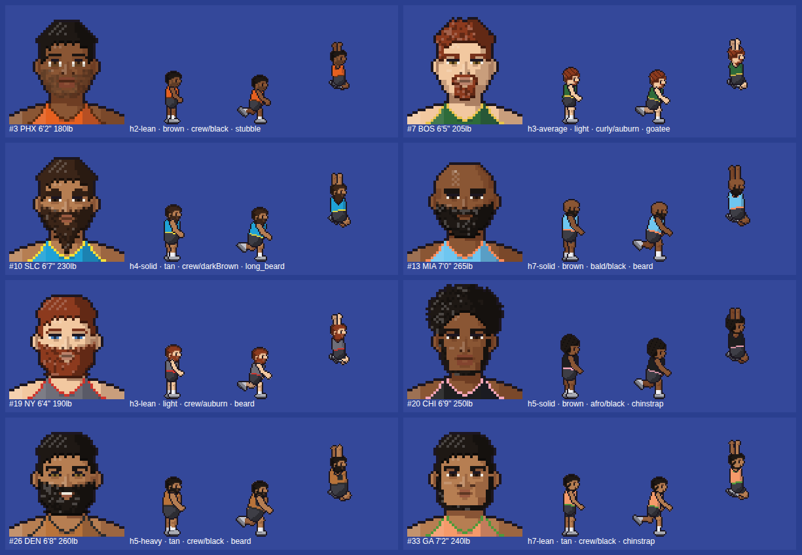

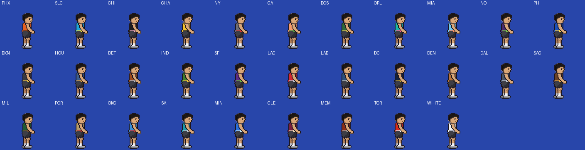
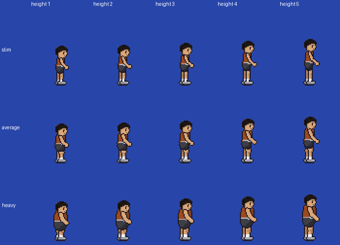
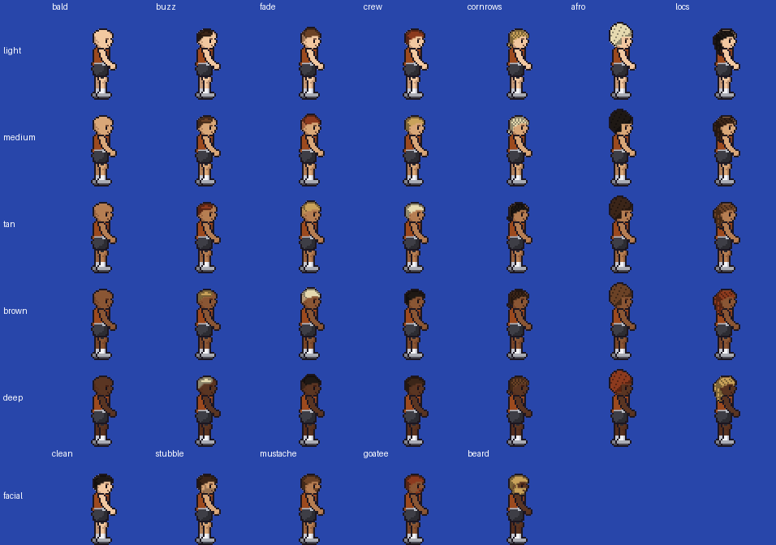
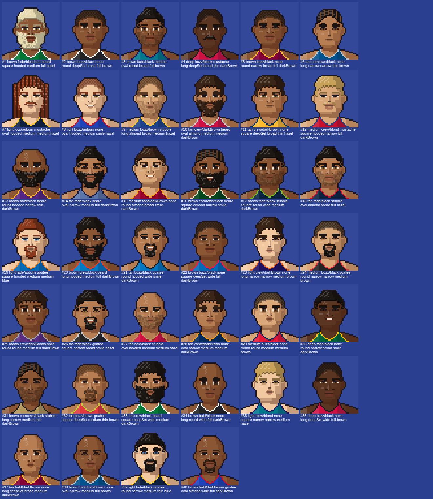
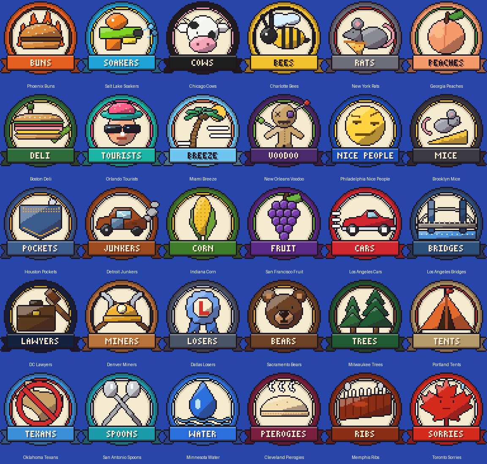

# Basketball Sprites

Pixel-art court sprites and headshots for the sim league. Both come from the same seeded `FaceSpec`, so a player's headshot and his in-game sprite always match.





| | |
|---|---|
|  |  |
|  |  |

## What's included

**Court sprites** (side view, facing right)
- **15 bodies:** 5 height classes × 3 weight classes.

  | Height class | 1 | 2 | 3 | 4 | 5 |
  |---|---|---|---|---|---|
  | Height | 6'2" and under | 6'3"–6'5" | 6'6"–6'8" | 6'9"–6'11" | 7'0"+ |

  The weight class comes from BMI: slim < 23.5 ≤ average < 26.5 ≤ heavy. The head is the same size on every body, so tall players look lanky and heavy players carry a gut. The game still scales each sprite by the player's real height.
- **30 league team jerseys + a white one** (see Team logos below), 5 skin tones, 7 hair styles (bald, buzz, fade, crew, cornrows, afro, locs), 6 hair colors, 5 facial-hair options (none, stubble, mustache, goatee, beard).
- **Always the same:** black shorts, grey shoes.
- **46 animations:** `walk`, `walk_dribble`, `walk_dribble_far`, `backpedal`, `idle_hips`, `idle_knees`, `defense_stance`, `defense_slide`, `defense_hands_up`, `shoot_pullup`, `shoot_fade`, `layup_finger_roll`, `layup_euro`, `dunk_windmill`, `dunk_tomahawk`, `behind_back_up`, `behind_back_down`, `between_legs_up`, `between_legs_down`, `hesitation`, `hesitation_far`, `screen_set`, `screen_hold`, `screen_contact`, `idle`, `run`, `run_start`, `run_stop`, `turn`, `turn_run`, `turn_dribble`, `dribble`, `dribble_run`, `dribble_far`, `dribble_run_far`, `crossover_up`, `crossover_down`, `shoot`, `layup`, `pass`, `steal`, `block`, `rebound`, `dunk_basic`, `dunk_athletic`, `dunk_hang`.
- **No ball, shadow or rim in the art.** Frames list where the ball and hands are.

**Headshots** (front view)
- `faceFromSeed(playerId)` → `FaceSpec`, then `faceSvg(face, id, jersey)` → one self-contained SVG, on the same 200×240 grid and square crop (`viewBox="12 24 176 176"`) as before.
- Drawn as 50×60 pixel art in the same style as the sprites. Every pixel is a crisp square, grouped into one `<path>` per color with `shape-rendering="crispEdges"`, so it stays sharp at any size.
- **Features:** 4 head shapes, 5 eye shapes, 5 noses, 4 mouths, 5 eye colors, brow weight, plus the same skin, hair and facial-hair options as the sprite. The jersey uses the team color (navy if none) and can show a number.

## Team logos



30 retro pixel-art badges for the league's own teams, in **`integration/react-native/teamLogos/`**:

| File | What it is |
|---|---|
| `png/<ID>.png` | Full round badge, 512×512 |
| `png/<ID>_icon.png` | Icon only, transparent, 384×384 (scoreboards, small UI) |
| `svg/<ID>.svg` | Badge as crisp vector squares |
| `teams.json` / `index.ts` | Ids, city, name, jersey and trim colors, plus `TEAM_LOGOS` / `TEAM_ICONS` require maps |

```tsx
import { LEAGUE_TEAMS, TEAM_LOGOS } from './teamLogos';
<Image source={TEAM_LOGOS['PHX']} style={{ width: 64, height: 64 }} />
```

**Team colors live in `tools/generate_logos.py`.** Running `python3 tools/generate_logos.py` redraws the logos and also writes the same 30 teams into `playerSprites/palettes.json`, so jerseys always match the logos.

Three teams are placeholders because your list didn't cover them: **Cleveland Pierogies, Memphis Ribs and Toronto Sorries**. Orlando is the **Tourists**, because Mickey is still a Disney trademark. To rename or redraw a team, edit its row in `TEAMS` and its `icon_*` function, then rerun.

## Files

Everything the app needs is in **`integration/react-native/playerSprites/`**.

| File | What it is |
|---|---|
| `palettes.json` | **Edit to change colors:** teams, skin tones, hair and eye colors, height/weight cutoffs. No regenerating needed. |
| `features.ts` | The option lists (skin tones, hair styles…) and body keys, shared by headshots and sprites. |
| `faceArt.ts` | `faceFromSeed`, `faceSvg`, `FaceSpec`, `BY_SKIN`. Replaces the app's current `faceArt.ts`. |
| `Headshot.tsx` | `<Headshot playerId size jersey />`, a thin `SvgXml` wrapper. |
| `appearance.ts` | `playerLook(id, heightIn, weightLbs)` / `lookFromFace()` for sprites, `bodyFor()`, teams, `jerseysForGame()`. |
| `PlayerSprite.tsx` | `<PlayerSprite>` plus `frameAt`, `scaleForHeight`, `frameToScreen`. |
| `moves.ts` | `crossoverFor(dy)`, `handAfter()`, `dribbleAnim(hand, moving)`. |
| `animController.ts` | `PlayerAnimator`: picks animation, frame and facing from velocity, with smooth turns and transitions (see below). |
| `faceArt.test.ts`, `appearance.test.ts` | Jest tests (see below). |
| `spriteData.*`, `atlas/*.png` | Generated. Don't edit by hand. |

## How a face is generated

Same design as the app's current system:

1. The seed is the league player's numeric id. `rng(seed)` is mulberry32.
2. Skin tone is picked first (5 tones, weighted `[1, 1, 1.2, 1.3, 1.2]`).
3. Everything else is picked to suit that tone via the `BY_SKIN` table, which gives each tone its own odds for hair color, eye color, coily hair (0.15 → 0.95), nose and mouth. The deepest tone never gets blue/green eyes or blond/auburn hair.
4. Hair style has separate weights for coily and straight hair. Head shape and eyes are even odds. Facial hair leans toward none. Brow weight is 0.85–1.25.
5. Nothing is stored. The face is recomputed from the id every time.

This is a fresh implementation, so its random draws won't line up with the old `faceArt.ts`. **Existing players will get new faces**, but each one stays stable from then on.

## Smooth movement (no flicker)

When players, especially the AI, change direction a lot, flipping the sprite the instant `vx` changes sign makes them strobe. Restarting animations on every state change makes them pop. `PlayerAnimator` fixes both. Create one per player and call it every rendered frame:

```ts
const animator = new PlayerAnimator(initialFacing);   // once per player

// every frame (dt in seconds, velocity in court ft/s)
const { anim, frame, flip } = animator.update(dt, {
  vx, vy, hasBall,
  face,        // optional: keep facing this way (defender on the ball handler) -> backpedals instead of turning
  defending,   // optional: stance when still, slide when moving sideways, backpedal when giving ground
  tired,       // optional: idles with hands on knees
});
<PlayerSprite look={look} colors={colors} anim={anim} frame={frame} flip={flip} ... />

// one-off moves: they play once, then movement resumes
animator.play('shoot', towardBasket);  // optional facing, applied instantly
animator.play(crossoverFor(dy));       // the dribbling hand updates itself

// setting a screen: frozen in place (no turning, no running) until released
animator.hold('screen_hold', 'screen_set');
animator.play('screen_contact');       // when a defender runs into it
animator.release();                    // roll or pop out: movement resumes
```

- **Turns:** facing changes only after the new direction has held for `turnDelay` (0.15 s), and always through a turn animation:
  - `turn`: standing pivot;
  - `turn_run`: plant, skid and go the other way;
  - `turn_dribble`: turning with the ball, which bounces under him while he turns.

  Each turn passes through two square-on frames that mirror each other, and the flip happens between them (`events.flipAt`), so it doesn't read as a jump.
- **Start and stop:** `run_start` and `run_stop` play between standing and running. Both have hysteresis and a short minimum hold, so a player hovering around the run threshold doesn't flicker between idle and run.
- **Stride:** the run cycles are now 12 frames at 18 fps (in-betweens generated from the key poses). `run`, `dribble_run` and `dribble_run_far` share one stride clock, so picking up or giving up the ball never restarts the legs. The stride speeds up and slows down with actual speed, so feet don't slide.
- **Tuning:** all thresholds are options: `runOn`, `runOff`, `turnSpeed`, `turnDelay`, `minHold`, `refSpeed`. The defaults assume feet per second.

If you drive animations yourself instead, keep the same rules: never flip `facing` directly from the sign of `vx`, and don't reset the frame counter when switching between run and dribble_run.

## Directions: up/down, near/far

The camera sits on the near sideline, so moving **up the screen** means moving away from the camera and **down** means toward it. For a player facing right, his **left** side is up (the far side) and his **right** side is down (the camera side).

The sprites name things by screen side, not by left or right hand:

| Term | Meaning |
|---|---|
| **near hand** | The camera-side hand, drawn in front of the body. It's the player's right hand when facing right and his left hand when flipped to face left. |
| **far hand** | The other hand, drawn behind the body. |
| `crossover_up` | Ball goes near hand → far hand, and the player cuts **up** the screen. Facing right, that's a cross to his left. |
| `crossover_down` | Ball goes far hand → near hand, and the player cuts **down** the screen. |

These meanings hold whether or not the sprite is flipped, because flipping only mirrors left and right. You only need to track which hand has the ball (`'near'` or `'far'`):

```ts
// ball handler changes direction on screen (dy < 0 = up, away from the camera)
const anim = crossoverFor(dy);          // 'crossover_up' | 'crossover_down'
// start moving on events.cutStart; when it finishes:
hand = handAfter(anim);                 // 'far' after crossing up, 'near' after crossing down
const next = dribbleAnim(hand, moving); // dribble / dribble_run / dribble_far / dribble_run_far
```

Every frame has a `ballDepth` value from +1 (near side, toward the camera) through 0 (centred in front) to -1 (far side). Draw the ball **behind** the player when it's below 0, and nudge it down the screen by about `ballDepth × 4` art pixels so it sits on the right side of the body. The previews do exactly this.

## Using it

```tsx
import { Headshot, PlayerSprite, playerLook, teamById, jerseysForGame,
         scaleForHeight, frameAt } from './playerSprites';

// roster screens
<Headshot playerId={player.id} size={64} jersey={{ jersey: team.jersey, trim: team.trim, number: player.number }} />

// game setup: look is cheap to recompute, or cache it per player
const look = playerLook(player.id, player.heightInches, player.weightLbs);
const jerseys = jerseysForGame(teamById(homeId), teamById(awayId));

// every frame
<PlayerSprite
  look={look}
  colors={isHome ? jerseys.home : jerseys.away}
  anim="dunk_athletic"
  frame={frameAt('dunk_athletic', secondsInState)}
  x={feetScreenX} y={feetScreenY}                     // bottom-centre anchor
  scale={scaleForHeight(look.body, onScreenHeightPx)}
  flip={facingLeft}
/>
```

- **The mismatch is fixed.** The sprite look now comes from `faceFromSeed(player.id)`, the same numeric seed as the headshot. The old `generateLook()` (hash of the id string) is gone.
- **Jumps:** shoot, layup, block, rebound and the dunks have a small hop drawn in. Pass `bakedLift={false}` if the sim raises players with `z`.
- **Dunks and the rim:** position the jump so `nearHand`/`farHand` at the `dunk` frame land on the rim. For `dunk_hang`, loop frames `hangStart`–`hangEnd` while he hangs, then play the rest.

| Animation | Frames | FPS | Loop | Events |
|---|---|---|---|---|
| `idle` | 4 | 6 | yes | |
| `run` | 12 | 18 | yes | |
| `run_start` / `run_stop` | 3 / 5 | 14 | no | Standing ↔ running |
| `turn` / `turn_run` / `turn_dribble` | 6 | 16 | no | `flipAt: 3`: draw frames from 3 on facing the new way |
| `dribble` | 6 | 17.14 | yes | `bounce: 3` (0.35 s per bounce) |
| `dribble_run` | 12 | 17.14 | yes | `bounce: 3`, `bounce2: 9` |
| `dribble_far` / `dribble_run_far` | 6 / 12 | same | yes | Same as above, with the far hand |
| `crossover_up` / `crossover_down` | 6 | 14 | no | `cross: 2` (bounce in front), `catch: 3`, `cutStart: 3` |
| `shoot` | 8 | 12 | no | `gather: 0`, `rise: 2`, `release: 4` |
| `layup` | 8 | 12 | no | `gather: 0`, `takeoff: 2`, `release: 4`. Near hand |
| `pass` | 6 | 14 | no | `release: 3` |
| `steal` | 6 | 14 | no | `activeStart: 2`, `activeEnd: 4` |
| `block` | 6 | 10 | no | `takeoff: 1`, `activeStart: 2`, `activeEnd: 4` |
| `rebound` | 6 | 10 | no | `takeoff: 1`, `catch: 3` |
| `screen_set` | 4 | 12 | no | `set: 3`: jog in, plant a wide base, arms folded across the chest |
| `screen_hold` | 4 | 5 | yes | Braced screen stance (small breath) |
| `screen_contact` | 4 | 14 | no | `contact: 1`: absorbs the defender, back to the stance |
| `walk` | 12 | 12 | yes | Picked automatically below `sprintOn` speed; shares the stride clock with `run` |
| `walk_dribble` / `walk_dribble_far` | 12 | 11.43 | yes | Bringing it up the court; `bounce: 2, 6, 10` |
| `backpedal` | 8 | 10 | yes | Moving backward while facing forward |
| `idle_hips` / `idle_knees` | 4 | 4 | yes | Waiting (after `idleVariantAfter`) / tired (`tired: true`) |
| `defense_stance` / `defense_slide` | 4 / 8 | 6 / 12 | yes | Low hand at the ball, high hand up; slide = shuffle steps |
| `defense_hands_up` | 4 | 6 | yes | Contest, e.g. `animator.hold('defense_hands_up')` |
| `shoot_pullup` / `shoot_fade` | 8 | 12 | no | Moving shots: toward the basket / fading away. `shotFor(speedTowardBasket)` picks. `release: 4` |
| `layup_finger_roll` / `layup_euro` | 8 | 12 | no | `release: 4` / `release: 5` (euro swings the ball across the body) |
| `dunk_windmill` / `dunk_tomahawk` | 8 / 7 | 12 / 11 | no | `dunk: 6` / `dunk: 5` |
| `behind_back_up/down`, `between_legs_up/down` | 6 | 14 | no | Hand switches like the crossovers; `handSwitch(move, dy)` picks |
| `hesitation` / `hesitation_far` | 6 | 12 | no | Rise to sell the stop, then `burst: 3`; same hand |
| `dunk_basic` | 8 | 12 | no | `gather: 0`, `takeoff: 2`, `dunk: 4`. One hand, like the layup |
| `dunk_athletic` | 8 | 11 | no | `gather: 0`, `takeoff: 2`, `dunk: 5`. Heels kicked up, both hands |
| `dunk_hang` | 8 | 10 | no | `gather: 0`, `takeoff: 2`, `dunk: 4`, `hangStart: 5`, `hangEnd: 6` |

## Memory

Each player is drawn from tinted layers: skin, jersey, trim, a crisp detail layer, then facial hair and hair. There are up to 8 small `View`+`Image` pairs per player.

- **Masks** (the tinted parts) are stored at 2× and **detail** at 3×. A mask's soft edge always sits under the crisp outline, so it isn't visible.
- **Per-body pages:** each body's atlas pages are only decoded when a player with that body is on screen. That's about 12–17 MB per body, plus about 10 MB shared for hair and facial hair. A typical game with ~7 distinct bodies uses roughly 110 MB.
- **Knob:** `SCALE` in the generator is 3. `SCALE = 4` gives sharper outlines, for about 70% more body memory.
- **Data size:** `spriteData.json` is about 3 MB and is bundled into the JS. It works, but it could be slimmed down if app startup time matters.

## Tests

```bash
npx jest playerSprites
```

The tests cover:
- the same seed gives the same face and SVG;
- 50 seeds give more than 45 distinct faces;
- the deepest skin tone never gets blue/green eyes or blond/auburn hair;
- the SVG is self-contained, with scoped `f<id>` ids and no `undefined`/`NaN`;
- every option of every feature draws;
- the sprite look matches the headshot;
- body classes are picked correctly;
- the sprite data covers every body × animation × hair × facial hair;
- crossovers move the ball across the body, and the direction helpers pick the right animation;
- `PlayerAnimator`: walk ↔ run keeps the stride, backpedal and defensive slides, idle variety, hand switches after every hand-switch move; jittery velocity never flips the sprite, real direction changes turn at `flipAt`, start/stop transitions play, the stride survives run ↔ dribble_run, and the run never skips a frame at 60 fps;
- jersey clashes switch the away team to white.

## Regenerating the sprite art

```bash
pip install pillow
python3 tools/generate_sprites.py      # ~30 s
```

This rewrites the atlas, `spriteData.*`, and the sprite previews in `previews/`.
- **Poses:** joint-angle tables such as `dunk_hang_frames()`, where 0° points down, 90° forward and 180° up.
- **Bodies:** `BASE_BODY` × `HEIGHT_CLASSES` / `WEIGHT_CLASSES`.
- **Side-view hair and facial hair:** pixel templates in `HAIR_STYLES` / `FACIAL_HAIR`.
- **Headshot art:** lives in `faceArt.ts`. There's nothing to regenerate there.
