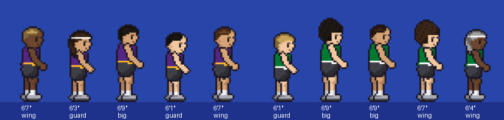

# Basketball Sprites

Pixel-art player sprites for the sim league. There is one set of art. The game colors it at runtime, so every team jersey, skin tone and hair color comes from the same images.


| | |
|---|---|
|  |  |



## What's included

- **32 team jerseys + a generic white one.** The 30 NBA teams in their current colors, plus 2 expansion slots (Seattle, Las Vegas). Each team has a jersey color and a trim color (collar, arm-holes, waistband).
- **4 skin tones:** light, medium, tan, dark.
- **4 hair styles:** short, buzz, afro, long with headband. Bald works too (`hairStyle: null`). Hair color is any color; the palette has black, dark brown, brown, blonde, red and gray.
- **3 builds:** guard (≤ 6'3"), wing (6'4"–6'8"), big (6'9"+). Bigs have longer legs and a broader chest, and guards are compact. The game still scales each player by his real height on top of that.
- **Always the same:** black shorts, grey shoes, white socks.
- **10 animations:** `idle`, `run`, `dribble`, `dribble_run`, `shoot`, `layup`, `pass`, `steal`, `block`, `rebound`.
- **No ball and no shadow in the art.** Each frame lists where a held ball should be drawn.

## Files

Everything the app needs is in **`integration/react-native/playerSprites/`**. Copy that folder into the app, e.g. `apps/mobile/src/game/playerSprites/`.

| File | What it is |
|---|---|
| `palettes.json` | **Edit this to change colors.** Team jerseys and trims, skin tones, hair colors, hair-style weights, build height cutoffs. No regeneration needed. |
| `PlayerSprite.tsx` | The `<PlayerSprite>` component plus helpers (`frameAt`, `scaleForHeight`, `frameToScreen`). |
| `appearance.ts` | `generateLook()` for new players, team lookups, and `jerseysForGame()` (away team wears white on a color clash). |
| `types.ts` | Types. |
| `spriteData.ts` / `spriteData.json` / `atlas/*.png` | Generated art and frame data. Don't edit by hand. |

`previews/` has PNG and GIF previews, and `sprites/ball.png` is an optional ball sheet.

## How it works

React Native's `<Image tintColor>` paints every visible pixel one flat color, so each frame is split into layers:

1. **skin**: white mask, tinted with the skin tone
2. **jersey**: white mask, tinted with the team color
3. **trim**: white mask, tinted with the team trim
4. **detail**: full color: outlines, shorts, shoes, eyes, plus see-through shading over the tinted parts
5. **hair**: white mask tinted with the hair color, plus its own detail layer

The pieces are trimmed, de-duplicated and packed into 5 atlas pages, about 200 KB on disk and about 65 MB of image memory once decoded. The art is pre-scaled 6× (a standing wing is 264 px tall) so it stays sharp when the phone scales it down.

## Using it

```tsx
import { PlayerSprite, generateLook, teamById, jerseysForGame,
         scaleForHeight, frameAt } from './playerSprites';

// once, when a player is created. Store `look` on the player record
const look = generateLook(hash(player.id), player.heightInches);

// once per game
const jerseys = jerseysForGame(teamById(homeId), teamById(awayId));

// every frame
<PlayerSprite
  look={look}
  colors={isHome ? jerseys.home : jerseys.away}
  anim="dribble_run"
  frame={frameAt('dribble_run', secondsInState)}
  x={feetScreenX} y={feetScreenY}                      // bottom-centre anchor
  scale={scaleForHeight(look.build, onScreenHeightPx)}  // e.g. ~105 px for 6'6" near side
  flip={facingLeft}
/>
```

- **Anchor:** `x`/`y` is where the feet touch the floor. Every frame uses the same canvas, so the feet stay put.
- **Height:** `scaleForHeight(build, px)` makes the standing player exactly `px` tall. Compute `px` from his real height and camera depth, the same way the rectangles work now.
- **Jumps:** `shoot`, `layup`, `block` and `rebound` have a small hop drawn in. If the sim already raises the player with `z`, pass `bakedLift={false}` so the hop isn't added twice.
- **Ball:** each frame has `ball` (where a held ball goes), `nearHand` and `farHand` in frame pixels. `frameToScreen()` converts them to screen positions.
- **Timing events** are in `SPRITES.anims[anim].events`:

| Animation | Frames | FPS | Loop | Events |
|---|---|---|---|---|
| `idle` | 4 | 6 | yes | |
| `run` | 8 | 12 | yes | |
| `dribble` | 6 | 17.14 | yes | `bounce: 3`. One bounce per 0.35 s cycle |
| `dribble_run` | 8 | 11.43 | yes | `bounce: 2`, `bounce2: 6`. Two bounces per stride, 0.35 s apart |
| `shoot` | 8 | 12 | no | `gather: 0`, `rise: 2`, `release: 4` |
| `layup` | 8 | 12 | no | `gather: 0`, `takeoff: 2`, `release: 4`. Always the near (camera-side) hand |
| `pass` | 6 | 14 | no | `release: 3`. Two-hand chest pass |
| `steal` | 6 | 14 | no | `activeStart: 2`, `activeEnd: 4` |
| `block` | 6 | 10 | no | `takeoff: 1`, `activeStart: 2`, `activeEnd: 4` |
| `rebound` | 6 | 10 | no | `takeoff: 1`, `catch: 3` |

To sync the dribble to the sim's ball instead of the clock, pick the frame from the ball's bounce phase: `Math.floor(phase * frameCount)`.

## Tweaking

- **Colors:** edit `palettes.json`. It applies on the next reload.
- **Look odds:** `weight` on hair styles and hair colors in `palettes.json`. Skin tones are picked evenly.
- **Build cutoffs:** `builds.guardMaxInches` / `wingMaxInches` in `palettes.json`.
- **Art, poses, new hair styles or animations:** edit `tools/generate_sprites.py`, then run it:

```bash
pip install pillow
python3 tools/generate_sprites.py
```

This rewrites the atlas, `spriteData.json/.ts` and `previews/`. Poses are joint-angle tables such as `shoot_frames()` and `layup_frames()`, where 0° points down, 90° forward and 180° up. Builds are bone lengths in `BUILDS`, and hair styles are pixel templates in `HAIR_STYLES`.

## Performance note

Each player is up to 6 small `View` + `Image` pairs, about 60 for 10 players, all redrawn every frame. That's in line with how the court is drawn now. If it ever gets heavy, `@shopify/react-native-skia` (works in Expo) can draw the same atlas with one canvas and a color-swap shader.
