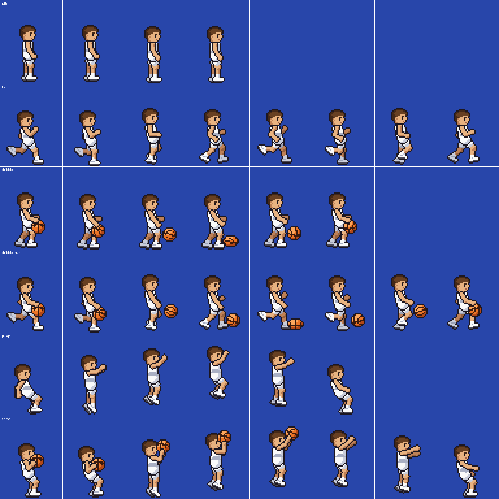

# Basketball Sprites

Pixel-art sprites for a side-view basketball game: one player in a plain white jersey, plus the ball.



## Files

| File | What it is |
|---|---|
| `sprites/player_white.png` | Player sheet. The ball is drawn into the dribble and shoot frames. |
| `sprites/player_white_noball.png` | The same sheet with no ball, for drawing the ball yourself using `ball.png`. |
| `sprites/player_white.json` | Frame rectangles, animation lists, fps, and the ball/hand position in every frame. |
| `sprites/ball.png` / `ball.json` | Ball: 8 spin frames, 1 squashed (floor-contact) frame, 1 drop shadow. 11×11 each. |
| `previews/*.gif` | Animated previews at 4× scale. |
| `tools/generate_sprites.py` | The generator. Edit poses or colors here and re-run it. |

## Player sheet layout

Each frame is **48×64 px**. Each row is one animation, and frames read left to right:

| Row | Animation | Frames | FPS | Loop | Notes |
|---|---|---|---|---|---|
| 0 | `idle` | 4 | 6 | yes | Small breathing bob (bonus) |
| 1 | `run` | 8 | 12 | yes | Full stride cycle |
| 2 | `dribble` | 6 | 10 | yes | Dribbling in place |
| 3 | `dribble_run` | 8 | 12 | yes | Dribbling on the move; one bounce per cycle |
| 4 | `jump` | 6 | 10 | no | Crouch, take-off, rise, peak, fall, land. Rebound/block jump |
| 5 | `shoot` | 8 | 12 | no | Jump shot. Ball leaves the hand after frame 4 |

- **Facing:** right. Flip horizontally to face left.
- **Anchor / feet:** grounded frames put the soles on pixel row 61 (the outline is row 62), with the body centered around x = 22. Anchor at `(22, 62)` (bottom-center-ish) and the feet stay planted.
- **Jumping:** `jump` has only a small built-in hop, so your game code should move the sprite up and down for the jump arc. `shoot` has a small hop built in, so it can play in place.
- **Shooting:** frames 0–4 show the ball in hand. From frame 5 (`release_frame`) the ball is gone, so spawn a ball projectile at `release_ball_pos` (frame-local pixel coordinates in the JSON).
- **Separate ball:** each frame in the JSON has a `ball` field (center in frame pixels, or `null`) so you can draw `ball.png` yourself on `player_white_noball.png`.

## Palette

The sprites use a small fixed palette defined at the top of `tools/generate_sprites.py`. The jersey uses `white`, `white_shade` and `trim`. To make other teams, change those colors, or palette-swap them in a shader:

| Name | RGB |
|---|---|
| white | 250,250,250 |
| white_shade | 200,204,218 |
| white_dark | 156,162,182 |
| trim | 170,176,196 |

## Engine quick-start

**Godot 4:** make an `AnimatedSprite2D` and create `SpriteFrames` → "Add frames from sprite sheet", with 8 horizontal × 6 vertical cells. Pick the row for each animation. Set the texture filter to *Nearest*.

**Phaser 3:**
```js
this.load.spritesheet('player', 'sprites/player_white.png', { frameWidth: 48, frameHeight: 64 });
// frame index = row * 8 + column
this.anims.create({ key: 'run', frames: this.anims.generateFrameNumbers('player', { start: 8, end: 15 }), frameRate: 12, repeat: -1 });
```

**Unity:** set Sprite Mode to *Multiple*, Filter Mode to *Point*, Compression to *None*, then Slice → Grid By Cell Size 48×64.

**GameMaker / others:** strip import with 48×64 cells. Rows with fewer than 8 frames have blank cells at the end.

## Regenerating

```bash
pip install pillow
python3 tools/generate_sprites.py
```

Poses are tables of joint angles in `run_frames()`, `dribble_frames()`, `jump_frames()`, `shoot_frames()` and so on. For angles, 0° points straight down, 90° forward and 180° straight up.
